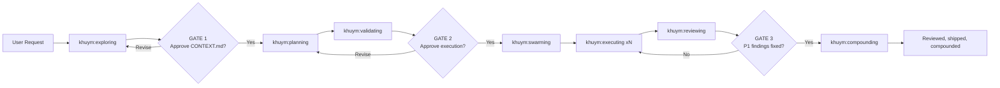

# Khuym Skills

Khuym is a Codex plugin repo that packages a validate-first workflow for agentic software development. The installable Codex plugin in this repository is `khuym`, shipped at [`plugins/khuym/`](plugins/khuym/).

Khuym is built for teams that want to turn ambiguous requests into reviewed, production-ready changes without skipping planning or quality gates.

## What A Khuym Run Looks Like

Ask for a feature like:

> "Add inbound email support for the agent inbox."

Khuym is designed to move that request through a repeatable chain:

1. `khuym:exploring` locks the missing decisions into `CONTEXT.md`.
2. `khuym:planning` turns those decisions into a phase plan, a current-phase contract, a story map, and beads.
3. `khuym:validating` checks that the current phase is sound before any implementation starts.
4. `khuym:swarming` and `khuym:executing` implement the current phase with reservations and live graph coordination.
5. `khuym:reviewing` verifies the work and records P1/P2/P3 findings.
6. `khuym:compounding` captures durable learnings for future work.

The point is not ceremony for its own sake. The point is to make expensive misunderstandings and avoidable rework much less likely.

## When To Use Khuym

Use Khuym when:

- the request is ambiguous or under-specified
- the work spans multiple files, systems, or agents
- the cost of getting the plan wrong is meaningful
- you want a reviewed and auditable path from request to shipped work

Do not reach for the full chain when:

- the task is a one-line fix with no ambiguity
- the work is obviously local and low-risk
- you do not need beads, coordination, or formal review gates

## Working Modes

Khuym keeps one core workflow but presents it in three user-facing modes:

- `small_change` — lightweight planning and validating for bounded low-risk work
- `standard_feature` — the default full Khuym workflow
- `high_risk_feature` — the full workflow plus deeper planning scrutiny and stronger spike discipline

The core contract does not change across modes:
- `CONTEXT.md` is still the source of truth
- `validating` still gates execution
- beads + `bv` + Agent Mail still drive coordination

## Current Situation

Khuym is not a greenfield framework. It sits downstream of several strong agentic-development systems and distills the parts that fit this repo owner's actual workflow.

- **[Flywheel](https://agent-flywheel.com/complete-guide)** contributes the operational backbone: beads, `bv`, Agent Mail, swarm execution, and the habit of turning plans into live work graphs instead of loose TODO lists.
- **[GSD](https://github.com/gsd-build/get-shit-done)** contributes the philosophy: discuss first, research second, plan third, and do not execute until the plan has been verified.
- **[Compound Engineering](https://github.com/EveryInc/compound-engineering-plugin)** contributes parallel review, severity-based findings, and the compound-learning loop that feeds future work.
- **[Superpowers](https://github.com/obra/superpowers)** contributes skill design patterns, Socratic extraction, and the idea that skills should be strong enough to shape agent behavior consistently.
- **V3 synthesis** contributes the bias to prove risky ideas early instead of discovering blockers halfway through execution.

The important point is that Khuym does not try to mirror any one upstream framework exactly. It selects the pieces that hold up in practice, removes generic abstraction where it weakens the flow, and reassembles them into a single opinionated chain.

## How Khuym Distills Those Frameworks

Khuym turns upstream ideas into a custom workflow contract rather than a loose bundle of inspirations:

1. It makes `CONTEXT.md` the source of truth so downstream skills execute against locked decisions rather than reinterpreting intent at every step.
2. It promotes validation into its own first-class skill, `khuym:validating`, because the GSD lesson is structural: phases should not execute until their contract, stories, and beads pass verification.
3. It keeps Flywheel's swarm and bead infrastructure, but reshapes it into explicit Khuym skill boundaries: `exploring`, `planning`, `validating`, `swarming`, `executing`, `reviewing`, and `compounding`.
4. It absorbs review, finish, and learning capture into one continuous workflow so the system does not stop at "code was written"; it closes only after verification and compounding.

## Workflow First

Khuym treats software delivery as a staged chain where each skill hands off explicit artifacts to the next stage:

- `khuym:exploring` extracts decisions and locks them in `CONTEXT.md`
- `khuym:planning` researches the work, writes a phase contract, maps the internal stories, and only then decomposes to beads
- `khuym:validating` verifies the phase contract, story map, and bead graph before execution begins
- `khuym:swarming` launches and coordinates worker subagents
- `khuym:executing` runs the worker loop (claim, reserve, implement, verify, close)
- `khuym:reviewing` performs multi-agent review plus acceptance checks
- `khuym:compounding` captures learnings for future work



```
khuym:exploring → khuym:planning → khuym:validating → khuym:swarming → khuym:executing(×N) → khuym:reviewing → khuym:compounding
```

The main differentiator is that execution is intentionally gated: the system does not proceed from planning into implementation until the phase has a clear exit state, coherent stories, and validated beads.

## Session Scout

On onboarded repos, Khuym installs a read-only scout command:

```bash
node .codex/khuym_status.mjs --json
```

It summarizes onboarding health plus `.khuym/state.json`, `.khuym/STATE.md`, and `.khuym/HANDOFF.json` so humans and agents can orient quickly before opening deeper artifacts.

## Human Gates

- **GATE 1** (after exploring): "Approve decisions/CONTEXT.md?"
- **GATE 2** (after validating): "Phase verified. Approve execution?"
- **GATE 3** (after reviewing): "P1 findings. Fix before merge?"

## Compact Workflow Example

1. `khuym:exploring` captures the decisions and constraints for a feature.
2. `khuym:planning` and `khuym:validating` turn those decisions into a clear phase contract, a story map, and verified executable beads.
3. `khuym:swarming` and `khuym:executing` implement the work in parallel with reservations and bead status updates.
4. `khuym:reviewing` enforces quality gates, then `khuym:compounding` captures reusable learnings.

## Where The Contract Lives

The README is the top-level overview. The operational contract lives in the repo docs:

- [`AGENTS.md`](AGENTS.md) defines the live Khuym chain, gates, bead workflow, and session rules.
- [`docs/architecture/ARCHITECTURE.md`](docs/architecture/ARCHITECTURE.md) is the canonical architecture and vocabulary contract.
- [`CONTRIBUTING.md`](CONTRIBUTING.md) covers skill format, marketplace packaging, and documentation checks.

## Install In Codex

Codex installation uses the repo marketplace in [`.agents/plugins/marketplace.json`](.agents/plugins/marketplace.json) and the packaged plugin at [`plugins/khuym/.codex-plugin/plugin.json`](plugins/khuym/.codex-plugin/plugin.json).

### Standard Install Flow

Codex plugins are installed from a local marketplace. The standard flow is:

1. Clone this repository locally:
   ```bash
   git clone https://github.com/hoangnb24/skills.git
   cd skills
   ```
2. In Codex, add this repository's marketplace file:
   ```text
   /absolute/path/to/skills/.agents/plugins/marketplace.json
   ```
3. Restart Codex if the new marketplace does not appear immediately.
4. Install the `khuym` plugin from that marketplace.
5. Start a new Codex session and ask for a Khuym workflow task.

The canonical skill layout lives directly under [`plugins/khuym/skills/`](plugins/khuym/skills).

If you also want the raw skill mirror for agent tooling outside the Codex plugin runtime, sync it into `~/.agents/skills`:

```bash
bash scripts/sync-skills.sh --target agents
```

### Verify The Plugin Layout

This repo follows the standard Codex plugin structure:

- Repo marketplace: [`.agents/plugins/marketplace.json`](.agents/plugins/marketplace.json)
- Plugin manifest: [`plugins/khuym/.codex-plugin/plugin.json`](plugins/khuym/.codex-plugin/plugin.json)
- Plugin skills: [`plugins/khuym/skills/`](plugins/khuym/skills)

For this repository, the installation flow is: clone the repo locally, add its marketplace, then install the plugin from that marketplace.

## Use In Claude Code

This repo no longer ships separate Claude plugin metadata. If you want Claude Code to see the same raw skills, mirror the canonical skill tree into `~/.claude/skills`:

```bash
bash scripts/sync-skills.sh --target claude
```

`scripts/sync-skills.sh` reads each skill directly from [`plugins/khuym/skills/`](plugins/khuym/skills), so Codex packaging and raw skill mirrors stay aligned.

## Skill Catalog

### Main Chain

These are the core delivery stages in the Khuym workflow:

| Skill | Purpose |
|-------|---------|
| `khuym:exploring` | Socratic dialogue → locked decisions in CONTEXT.md |
| `khuym:planning` | Research + synthesis → approach.md + phase-contract.md + story-map.md + beads |
| `khuym:validating` | Phase/story/bead verification (8 dims) + spikes + bead polishing — **THE GATE** |
| `khuym:swarming` | Launch + tend parallel worker agents via Agent Mail |
| `khuym:executing` | Per-agent worker loop: priority → reserve → implement → close |
| `khuym:reviewing` | Specialist review passes + 3-level verification + UAT |
| `khuym:compounding` | Capture learnings → history/learnings/ |

### Bootstrap, Support, And Meta Skills

These skills support the main chain without replacing it:

| Skill | Purpose |
|-------|---------|
| `khuym:using-khuym` | Bootstrap meta-skill — routing, go mode, state resume |
| `khuym:dream` | Manual dream consolidation pass over Codex artifacts and learnings (support) |
| `khuym:debugging` | Systematic debugging for blocked workers (support) |
| `khuym:gkg` | Codebase intelligence via gkg tool (support) |
| `khuym:writing-khuym-skills` | TDD-for-skills meta-skill |

`khuym:dream` is intentionally outside the main execution chain. It runs on demand, consolidates durable lessons into `history/learnings/`, uses a bootstrap-first scan model with recurring bounded updates after provenance exists, and never edits `history/learnings/critical-patterns.md` without explicit approval.

### Standalone Skills

Standalone skills remain available, but they are intentionally secondary to the Khuym chain in this repo's top-level narrative.

| Skill | Description |
|-------|-------------|
| `book-sft-pipeline` | Convert books into SFT datasets for training style-transfer models |
| `bootstrap-project-context` | Bootstrap a new session by reading repo docs and mapping the codebase |
| `prompt-leverage` | Upgrade raw prompts into stronger execution-ready prompts |
| `refresh-project-docs` | Refresh README and docs so they match the current repo state |
| `xia` | Research feature requests before implementation to avoid reinventing existing patterns |

## Requirements

- **Core tools:** `br` (beads CLI), `bv` (bead viewer), Agent Mail MCP server
- **Optional:** `gkg` (codebase intelligence), CASS/CM (session search)

## Documentation Checks

When you change public docs in this repo, keep links repository-relative and environment-agnostic.

Recommended verification set:

```bash
bash scripts/check-markdown-links.sh
bash scripts/sync-skills.sh --dry-run
bash scripts/sync-skills.sh --target all --dry-run
```

## License

MIT
