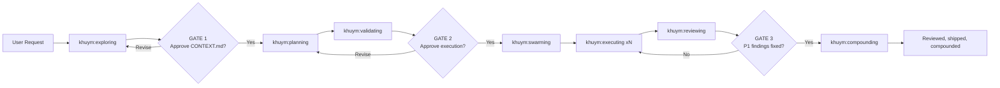

# Khuym Skills

Khuym is a validate-first workflow for agentic software development. It is built for teams that want to turn ambiguous requests into reviewed, production-ready changes without skipping planning or quality gates.

## Current Situation

Khuym is not a greenfield framework. It sits downstream of several strong agentic-development systems and distills the parts that fit this repo owner's actual workflow.

- **[Flywheel](https://agent-flywheel.com/complete-guide)** contributes the operational backbone: beads, `bv`, Agent Mail, swarm execution, and the habit of turning plans into live work graphs instead of loose TODO lists.
- **[GSD](https://github.com/gsd-build/get-shit-done)** contributes the philosophy: discuss first, research second, plan third, and do not execute until the plan has been verified.
- **[Compound Engineering](https://github.com/EveryInc/compound-engineering-plugin)** contributes parallel review, severity-based findings, and the compound-learning loop that feeds future work.
- **[Superpowers](https://github.com/obra/superpowers)** contributes skill design patterns, Socratic extraction, and the idea that skills should be strong enough to shape agent behavior consistently.
- **V3 synthesis** contributes the bias to prove risky ideas early instead of discovering blockers halfway through execution.

The important point is that Khuym does not try to mirror any one upstream framework exactly. It selects the pieces that hold up in practice, removes generic abstraction where it weakens the flow, and reassembles them into a single opinionated chain.

## How Khuym Distills Those Frameworks

Khuym turns upstream ideas into a custom workflow contract rather than a loose bundle of inspirations:

1. It makes `CONTEXT.md` the source of truth so downstream skills execute against locked decisions rather than reinterpreting intent at every step.
2. It promotes validation into its own first-class skill, `khuym:validating`, because the GSD lesson is structural: plans should not execute until they pass verification.
3. It keeps Flywheel's swarm and bead infrastructure, but reshapes it into explicit Khuym skill boundaries: `exploring`, `planning`, `validating`, `swarming`, `executing`, `reviewing`, and `compounding`.
4. It absorbs review, finish, and learning capture into one continuous workflow so the system does not stop at "code was written"; it closes only after verification and compounding.

## Workflow First

Khuym treats software delivery as a staged chain where each skill hands off explicit artifacts to the next stage:

- `khuym:exploring` extracts decisions and locks them in `CONTEXT.md`
- `khuym:planning` researches and decomposes implementation into executable beads
- `khuym:validating` verifies the plan and bead graph before execution begins
- `khuym:swarming` launches and coordinates worker subagents
- `khuym:executing` runs the worker loop (claim, reserve, implement, verify, close)
- `khuym:reviewing` performs multi-agent review plus acceptance checks
- `khuym:compounding` captures learnings for future work



```
khuym:exploring → khuym:planning → khuym:validating → khuym:swarming → khuym:executing(×N) → khuym:reviewing → khuym:compounding
```

The main differentiator is that execution is intentionally gated: the system does not proceed from planning into implementation until validation passes.

## Human Gates

- **GATE 1** (after exploring): "Approve decisions/CONTEXT.md?"
- **GATE 2** (after validating): "Beads verified. Approve execution?"
- **GATE 3** (after reviewing): "P1 findings. Fix before merge?"

## Compact Workflow Example

1. `khuym:exploring` captures the decisions and constraints for a feature.
2. `khuym:planning` and `khuym:validating` turn those decisions into verified executable beads.
3. `khuym:swarming` and `khuym:executing` implement the work in parallel with reservations and bead status updates.
4. `khuym:reviewing` enforces quality gates, then `khuym:compounding` captures reusable learnings.

## Install In Claude Code

This repo ships a Claude Code plugin marketplace in [`.claude-plugin/marketplace.json`](.claude-plugin/marketplace.json).

### Inside Claude Code (recommended)

```text
/plugin marketplace add hoangnb24/skills
/plugin install khuym:using-khuym@skills
```

## Direct Skill Sync

If you want the raw skill directories linked into `~/.claude/skills/` for local development, use the sync script:

```bash
bash scripts/sync-skills.sh
bash scripts/sync-skills.sh --dry-run
```

## Skill Catalog

### Khuym Ecosystem (`khuym/`)

The Khuym ecosystem is the primary story in this repository: a coordinated chain built around beads (`br`), bead viewer (`bv`), and Agent Mail.

| Skill | Purpose |
|-------|---------|
| `khuym:using-khuym` | Bootstrap meta-skill — routing, go mode, state resume |
| `khuym:exploring` | Socratic dialogue → locked decisions in CONTEXT.md |
| `khuym:planning` | Research + synthesis → approach.md + beads |
| `khuym:validating` | Plan verification (8 dims) + spikes + bead polishing — **THE GATE** |
| `khuym:swarming` | Launch + tend parallel worker agents via Agent Mail |
| `khuym:executing` | Per-agent worker loop: priority → reserve → implement → close |
| `khuym:reviewing` | Specialist review passes + 3-level verification + UAT |
| `khuym:compounding` | Capture learnings → history/learnings/ |
| `khuym:dream` | Manual dream consolidation pass over Codex artifacts and learnings (support) |
| `khuym:writing-khuym-skills` | TDD-for-skills meta-skill |
| `khuym:debugging` | Systematic debugging for blocked workers (support) |
| `khuym:gkg` | Codebase intelligence via gkg tool (support) |

### Standalone Skills (`standalone/`)

Standalone skills remain available, but they are intentionally secondary to the Khuym chain in this repo's top-level narrative.

| Skill | Description |
|-------|-------------|
| `book-sft-pipeline` | Convert books into SFT datasets for training style-transfer models |
| `prompt-leverage` | Upgrade raw prompts into stronger execution-ready prompts |

## Requirements

- **Core tools:** `br` (beads CLI), `bv` (bead viewer), Agent Mail MCP server
- **Optional:** `gkg` (codebase intelligence), CASS/CM (session search)

## License

MIT
