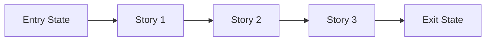

# Phase Contract: Phase <N> - <Phase Name>

**Date**: <YYYY-MM-DD>
**Feature**: <feature-slug>
**Phase Plan Reference**: `history/<feature>/phase-plan.md`
**Based on**:
- `history/<feature>/CONTEXT.md`
- `history/<feature>/discovery.md`
- `history/<feature>/approach.md`

---

## 1. What This Phase Changes

> Explain the phase in practical terms first. Someone should be able to picture what is different after this lands.

`<2-4 sentences describing the real-world/system change this phase delivers.>`

---

## 2. Why This Phase Exists Now

- `<why this phase is first or why it follows the previous one>`
- `<what would be blocked or riskier if this phase were skipped>`

---

## 3. Entry State

> What is true before this phase starts?

- `<observable truth 1>`
- `<observable truth 2>`
- `<constraint or dependency already satisfied>`

---

## 4. Exit State

> What must be true when this phase is complete?

- `<observable truth 1>`
- `<observable truth 2>`
- `<integration or system-level truth>`

**Rule:** every exit-state line must be testable or demonstrable.

---

## 5. Demo Walkthrough

> The simplest walkthrough that proves this phase is real.

`<In one short paragraph: "A user can now..." or "The system can now...">`

### Demo Checklist

- [ ] `<step 1>`
- [ ] `<step 2>`
- [ ] `<step 3>`

---

## 6. Story Sequence At A Glance

> Stories explain why the internal order of this phase makes sense before beads are created.

| Story | What Happens | Why Now | Unlocks Next | Done Looks Like |
|-------|--------------|---------|--------------|-----------------|
| Story 1: `<name>` | `<practical outcome>` | `<why first>` | `<what it unlocks>` | `<observable done>` |
| Story 2: `<name>` | `<practical outcome>` | `<why next>` | `<what it unlocks>` | `<observable done>` |
| Story 3: `<name>` | `<practical outcome>` | `<why last>` | `<what it unlocks>` | `<observable done>` |

---

## 7. Phase Diagram

If the phase has fewer than 3 stories, remove the unused nodes and keep the diagram aligned to the actual sequence.

---

## 8. Out Of Scope

- `<thing intentionally not solved in this phase>`
- `<adjacent idea deferred to a later phase>`

---

## 9. Success Signals

- `<how we know this phase genuinely worked>`
- `<what reviewers or UAT should specifically confirm>`

---

## 10. Failure / Pivot Signals

> If any of these happen, do not blindly continue to later phases.

- `<signal that means the phase design is wrong>`
- `<signal that means the current approach should pivot>`
- `<signal that means the next phase should be reconsidered>`
